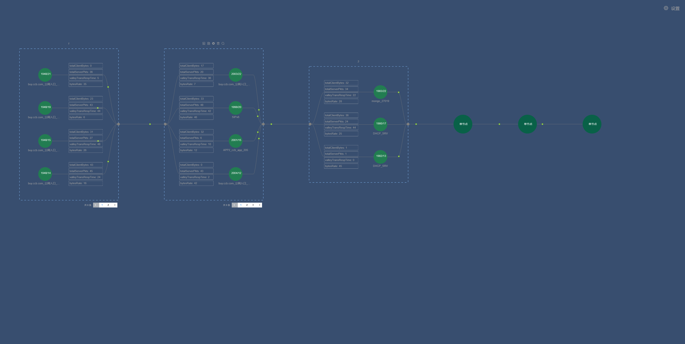

# adv-topology

## 项目介绍

- 可配置的拓扑结构，适用于单个或多个聚合的线性拓扑

- 模式介绍
    1. 全部展示：显示所有的节点，适用于节点较少的情况
    
    2. 分页模式：当节点过多时，全部展开会导致画布过高影响查看，分页模式可以设定分页的大小
    
    3. 超出隐藏：只需将注意力排在最前面的几个拓扑（可以按需排序）
    
- 其他功能介绍
    1. 首个集群全部展开：当首个节点数目过多时，可以通过两个节点共用一条连线的方式，较少一半的连线
    
    2. 在分页模式和超出隐藏模式下，支持节点的搜索 
    


## Project setup
```
npm install
```

### Compiles and hot-reloads for development
```
npm run serve
```

### Compiles and minifies for production
```
npm run build
```

### Lints and fixes files
```
npm run lint
```

### Customize configuration
See [Configuration Reference](https://cli.vuejs.org/config/).
